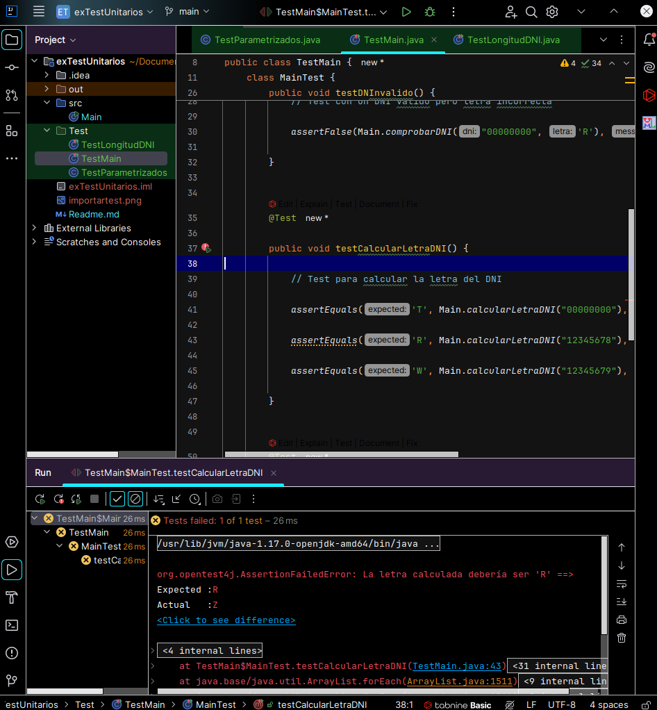
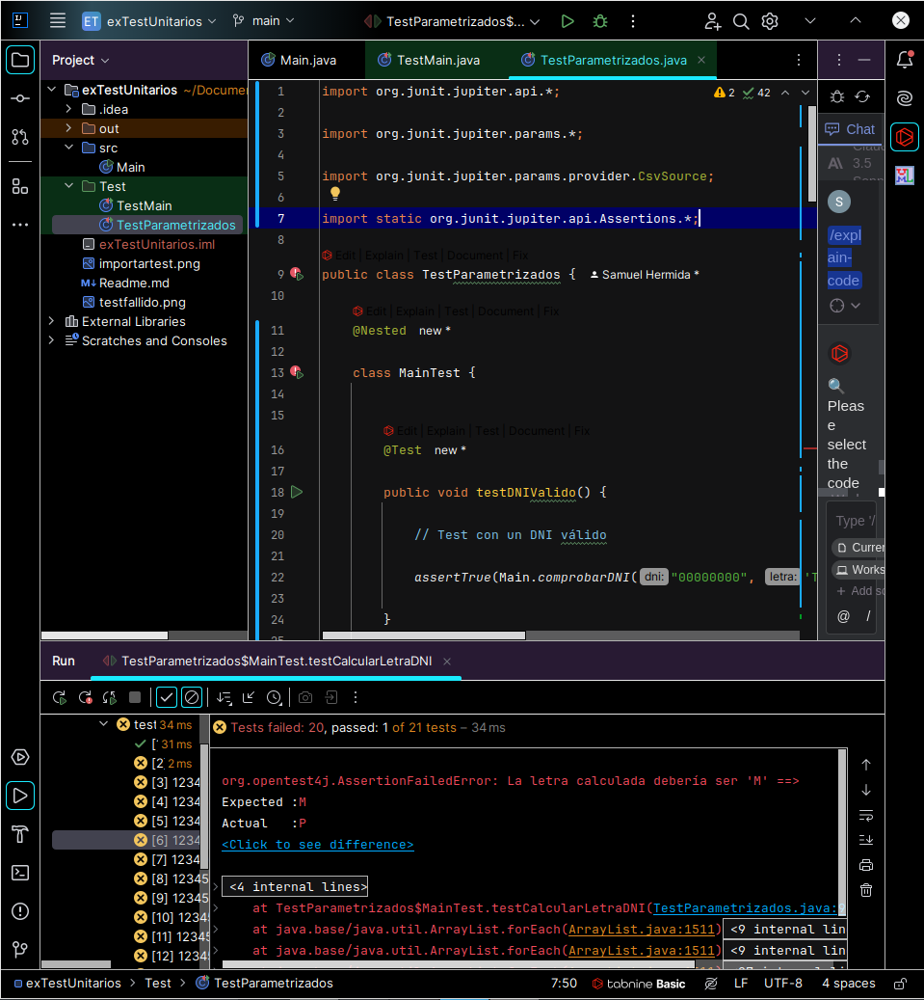

# Texto de el examen

## Examen de Test Unitarios

### Enunciado

Con el código de este repositorio realiza lo siguiente:

1. **Test Unitarios (4 puntos)**

   Implementa los test unitarios de los dos métodos, utilizando test parametrizados. Suponiendo que la cadena `DNI` siempre es un DNI válido.

2. **Identificación de Errores (2 puntos)**

   En el código, hay un error. ¿Pudiste comprobarlo en los test? Plantea la solución.

3. **Comprobación de Longitud de DNI (3 puntos)**

   Si no hubiera una comprobación previa en cuanto a la longitud de la cadena del DNI, ¿qué hay que cambiar en los tests para que comprueben estos casos?

### Entrega

Entrega tu repositorio con el código y los test. Además, incluye un README explicando y justificando cada apartado.

### Formato del README (1 punto)

# Comienzo del examen

## 1. Test Unitarios

Para los test unitarios, decidí primero pensar en cómo distribuirlos y de qué manera. En principio, consideré que solo había dos métodos, por lo cual debía hacer dos tests. Sin embargo, al final opté por realizar cuatro tests sencillos e intuitivos, que le pedí a una IA que me ayudara a generar para así conseguir una mayor eficiencia en ellos. Los tests en cuestión son los siguientes:

### Restricciones del DNI

Es importante mencionar que el DNI debe cumplir con las siguientes restricciones:

- Debe tener exactamente 8 dígitos numéricos.

- Debe ir seguido de una letra, que es la que se valida.

### Test de DNI Válido

       @Test

       public void testDNIValido() {

    -- Test con un DNI válido

    assertTrue(Main.comprobarDNI("00000000", 'T'), "El DNI debería ser correcto");

      }

### Test de DNI Inválido

       @Test

       public void testDNInvalido() {

    -- Test con un DNI válido pero letra incorrecta

    assertFalse(Main.comprobarDNI("00000000", 'R'), "El DNI debería ser incorrecto");

      }

### Test para Calcular la Letra del DNI

       @Test

       public void testCalcularLetraDNI() {

    -- Test para calcular la letra del DNI

            assertEquals('T', Main.calcularLetraDNI("00000000"), "La letra calculada debería ser 'T'");

            assertEquals('R', Main.calcularLetraDNI("12345678"), "La letra calculada debería ser 'R'");

            assertEquals('W', Main.calcularLetraDNI("12345679"), "La letra calculada debería ser 'W'");

            assertEquals('A', Main.calcularLetraDNI("12345670"), "La letra calculada debería ser 'A'");

            assertEquals('G', Main.calcularLetraDNI("12345671"), "La letra calculada debería ser 'G'");

            assertEquals('M', Main.calcularLetraDNI("12345672"), "La letra calculada debería ser 'M'");

            assertEquals('Y', Main.calcularLetraDNI("12345673"), "La letra calculada debería ser 'Y'");

            assertEquals('F', Main.calcularLetraDNI("12345674"), "La letra calculada debería ser 'F'");

            assertEquals('P', Main.calcularLetraDNI("12345675"), "La letra calculada debería ser 'P'");

            assertEquals('D', Main.calcularLetraDNI("12345676"), "La letra calculada debería ser 'D'");

            assertEquals('X', Main.calcularLetraDNI("12345677"), "La letra calculada debería ser 'X'");

            assertEquals('B', Main.calcularLetraDNI("12345678"), "La letra calculada debería ser 'B'");

            assertEquals('N', Main.calcularLetraDNI("12345679"), "La letra calculada debería ser 'N'");

            assertEquals('J', Main.calcularLetraDNI("12345680"), "La letra calculada debería ser 'J'");

            assertEquals('Z', Main.calcularLetraDNI("12345681"), "La letra calculada debería ser 'Z'");

            assertEquals('Q', Main.calcularLetraDNI("12345682"), "La letra calculada debería ser 'Q'");

            assertEquals('S', Main.calcularLetraDNI("12345683"), "La letra calculada debería ser 'S'");

            assertEquals('V', Main.calcularLetraDNI("12345684"), "La letra calculada debería ser 'V'");

            assertEquals('H', Main.calcularLetraDNI("12345685"), "La letra calculada debería ser 'H'");

            assertEquals('L', Main.calcularLetraDNI("12345686"), "La letra calculada debería ser 'L'");

            assertEquals('C', Main.calcularLetraDNI("12345687"), "La letra calculada debería ser 'C'");

            assertEquals('K', Main.calcularLetraDNI("12345688"), "La letra calculada debería ser 'K'");

            assertEquals('E', Main.calcularLetraDNI("12345689"), "La letra calculada debería ser 'E'");

      }

### Test para Letra de DNI Inválido

      @Test

       public void testLetraDNIInvalido() {

    -- Test para un DNI inválido (no numérico)

    assertThrows(NumberFormatException.class, () -> {

        Main.calcularLetraDNI("abcdefgh");

    }, "Debería lanzar una excepción por formato de número inválido");

      }

### Test para Letra de DNI prohiba en España

        @Test

        public void testDNICaracteresProhibidos() {

    -- Test para DNIs que contienen letras prohibidas

            assertFalse(Main.comprobarDNI("0000000", 'I'), "El DNI no debería ser válido porque contiene 'I'");

            assertFalse(Main.comprobarDNI("0000000", 'O'), "El DNI no debería ser válido porque contiene 'O'");

            assertFalse(Main.comprobarDNI("0000000", 'Ñ'), "El DNI no debería ser válido porque contiene 'Ñ'");

            assertFalse(Main.comprobarDNI("0000000", 'U'), "El DNI no debería ser válido porque contiene 'U'");

        }

Gracias a estos tests, decidí ejecutar los dos más importantes para este apartado, que eran el test de DNI válido (aclarando que siempre será válido, por lo cual solo debe hacerse con una opción) y quise agregar un poco de complejidad al de la comprobación de letra, ya que sospechaba que ahí podría estar el fallo. Efectivamente, el test dio error a continuacion estara una foto.

## 2. Identificación de Errores

Como mencioné, el test que falla es el de comprobación de la letra, ya que no se realiza correctamente la misma.

Este es un test normal y no un parametrizado, probemos con el parametrizado a continuacion

public class TestParametrizados {

    @Nested

    class MainTest {

        @Test

        public void testDNIValido() {

            // Test con un DNI válido

            assertTrue(Main.comprobarDNI("00000000", 'T'), "El DNI debería ser correcto");

        }

        @Test

        public void testDNInvalido() {

            // Test con un DNI válido pero letra incorrecta

            assertFalse(Main.comprobarDNI("00000000", 'R'), "El DNI debería ser incorrecto");

        }

        @ParameterizedTest

        @CsvSource({

                "00000000, T",

                "12345678, R",

                "12345679, W",

                "12345670, A",

                "12345671, G",

                "12345672, M",

                "12345673, Y",

                "12345674, F",

                "12345675, P",

                "12345676, D",

                "12345677, X",

                "12345680, J",

                "12345681, Z",

                "12345682, Q",

                "12345683, S",

                "12345684, V",

                "12345685, H",

                "12345686, L",

                "12345687, C",

                "12345688, K",

                "12345689, E"

        })

        public void testCalcularLetraDNI(String dni, char letraEsperada) {

            // Test para calcular la letra del DNI

            assertEquals(letraEsperada, Main.calcularLetraDNI(dni), "La letra calculada debería ser '" + letraEsperada + "'");

        }

        @Test

        public void testLetraDNIInvalido() {

            // Test para un DNI inválido (no numérico)

            assertThrows(NumberFormatException.class, () -> {

                Main.calcularLetraDNI("abcdefgh");

            }, "Debería lanzar una excepción por formato de número inválido");

        }

        @ParameterizedTest

        @CsvSource({

                "0000000, I",

                "0000000, O",

                "0000000, Ñ",

                "0000000, U"

        })

        public void testDNICaracteresProhibidos(String dni, char letraProhibida) {

            // Test para DNIs que contienen letras prohibidas

            assertFalse(Main.comprobarDNI(dni, letraProhibida), "El DNI no debería ser válido porque contiene '" + letraProhibida + "'");

        }

    }

}

Como se puede observar gracias al test parametrizado, este comprueba todo y asi puede tener una solucion mas epecifica y completa que el test normal,por lo cual he decidido realizar dos archivos de test diferentes dentro de la carpeta test, para asi tenerlo mejor organizado.

Para solucionar este error comprobaremos bien las letras en el codigo ya que el calculo no esta correctamente realizado